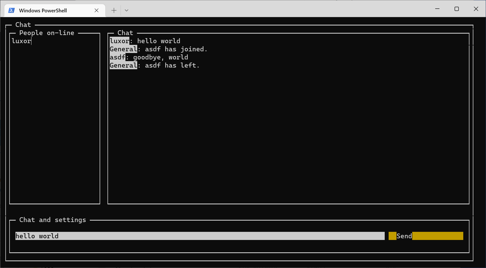

# TUI Chat

Simple text UI chat application, straight out of the 80s. Feature-poor, but has the groundwork for some features that would put it on par with IRC.

## Features

* user registration / login, properly hashed passwords with bcrypt
* multiroom support (could be used for DMs, multiple chatrooms) - missing UI components and system messages to create or change channels
* basic chat functionality
* list of connected users, system messages when a user leaves or join the room
* relatively light-weight client

## Drawbacks and known issues

* users can log into the same account simultaneously (not really an issue, but it should at least notify the user?)
* missing loading indicators - it may be possible to get the application into an inconsistent state if the user does not wait
* sometimes it is possible to lose focus on all UI elements and there is no way to get it back (generally the blessed library is very cursed in this aspect, focusing doesn't seem to work half of the time or I'm just doing it wrong)
* application will lose state on a server crash, the client would not know
* poor UI
* chat message is not removed from chat input box after sending it - couldn't get it to work, not very important

## Things I would do differently for a production project

* messages
  * separate project for the messages, serialization and deserialization so there would be no code duplication
  * might use a different format (protocolbuffers?), might save a few bytes from JSON formatting for chat, but the majority of the data sent is text anyway, might be useful for system messages that would utilize internal IDs instead
  * better message serialization and deserialization - current implementation is very naive and requires a lot of manual work (registering messag types is not automatic, must be careful with order of constructor arguments and serialization)
* enforce wss protocol, currently the passwords are sent in plaintext
* restructuring the code, utilizing events more
* using a different database engine for production environments, SQLite is good for testing
* confirmation if user wants to really exit the chat application, control c should work too
* typescript would save me from my many inattentive mistakes
* structuring the repo a bit better
* perhaps some basic security checks in passwords and such, reserving some system usernames, escaping names (formatting can be used in them)
* more colours in the UI
* better exception handling

## Things that could be added

* message formatting - technically working, but the syntax is arcane and could be made easier by using something like BBCode
* logging chat messages into the database, persistent chat rooms, loading chat history from the DB
* server logs for debugging
* blessed has a lot of support for advanced stuff like images and videos - might be a fun feature
* setting user username colours
* user-created rooms, ownership of rooms, kicking people, blocking people... room permissions in general